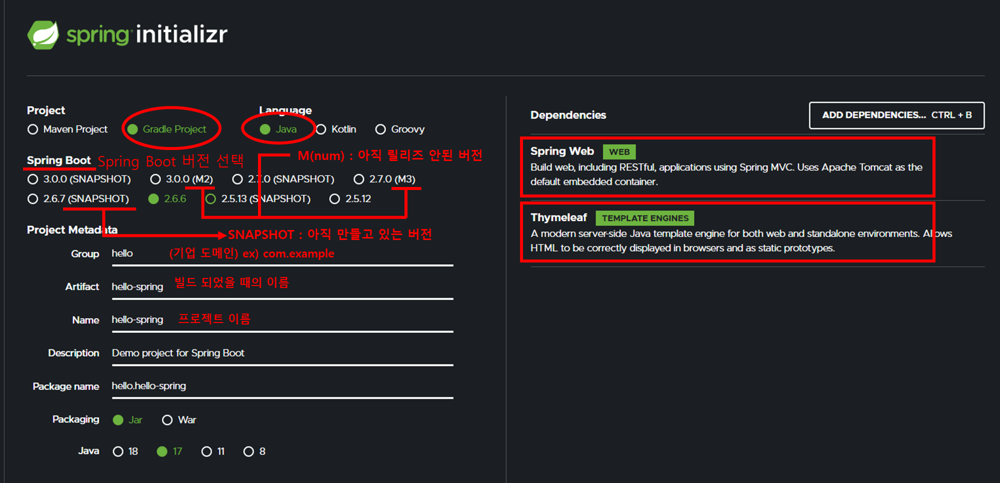
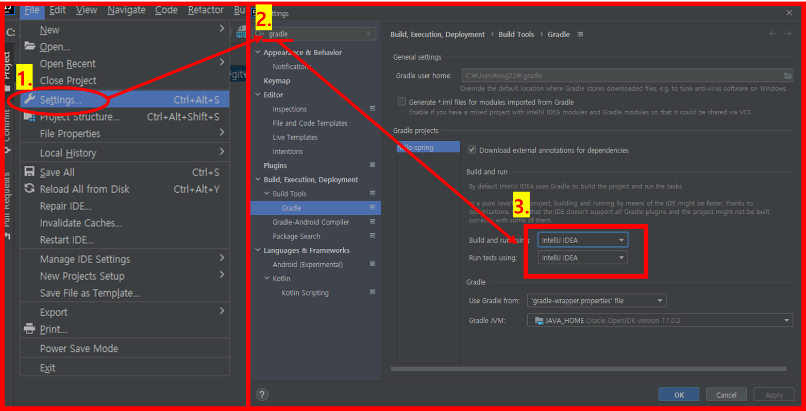

# 프로젝트 생성
## 환경
- java 설치
- intellij 설치

## Step 1. 스프링 부트 스타터 사이트 이동 및 스프링 프로젝트 생성
- https://start.spring.io

## Step 2. 프로젝트 선택

1. Gradle Project 선택
2. Java 선택
3. Spring Boot 선택
   - SNAPSHOT : 만들고 있는 버전 (선택 x)
   - M(num) : 아직 릴리즈 안된 버전 (선택 x)
4. 프로젝트 데이터 입력
5. Dependencies 선택
   - Spring Web
   - Thymeleaf
6. Generate 클릭 후 압축 풀기

## Step 3. Intellij에서 프로젝트 열기
- Intellij 실행 및 프로젝트 열기
- 압축 푼 폴더로 이동, build.gradle 선택 후 Open as Project로 열기

## Step 4. Intellij의 setting 설정
